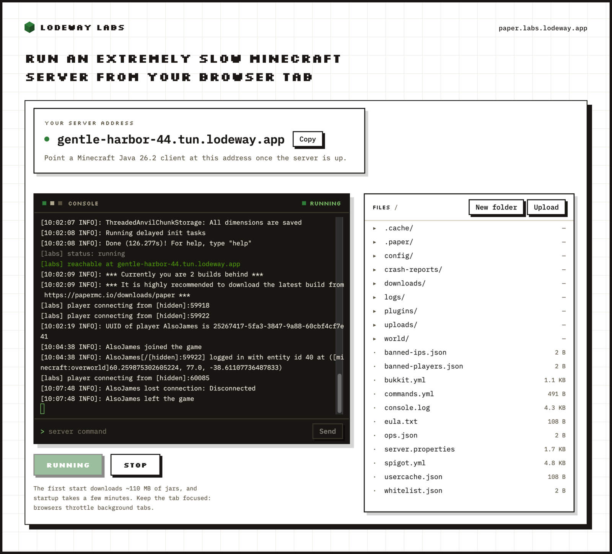

# Paper in the browser



A real Minecraft server, running in a browser tab. Live at [paper.labs.lodeway.app](https://paper.labs.lodeway.app).

This is the first [Lodeway Labs](https://labs.lodeway.app) experiment: [Paper](https://papermc.io) 26.2, ported to Java 8 bytecode and executed by [CheerpJ](https://cheerpj.com), a JVM written in WebAssembly and JavaScript. The world lives in your browser's storage. A WebSocket tunnel gives every visitor their own address, so a real Minecraft Java client can join the server running in your tab.

It is a toy, not a host. Close the tab and the server stops. But it is the whole server: the tick loop, chunk generation, commands, and a file tree you can poke at while it runs.

## How it works

- **The port.** Paper 26.2 wants Java 25. About thirty small patches remove the APIs that have no Java 8 equivalent (hidden classes, VarHandles in hot paths, virtual threads, FFM) and add an in-JVM netty transport, since a browser cannot open sockets. [JVMDowngrader](https://github.com/unimined/JvmDowngrader) then rewrites every jar to class file version 52. CheerpJ can also run Java 11 and 17 bytecode, but its Java 8 runtime is by far the fastest — and targeting Java 8 moves work to build time that the newer runtimes redo slowly in the tab (lambdas and string concatenation are desugared ahead of time, and a post-pass inlines the VarHandle emulation into direct field access). The result boots on a stock JDK 8.
- **The page.** CheerpJ loads ~110 MB of jars and runs `org.bukkit.craftbukkit.Main` on a single cooperative thread. The page talks to the JVM through JS-implemented natives: an output bridge for the console, a pull-based ops channel for the file manager and command input, and the tunnel bridge.
- **The tunnel.** The page opens a WebSocket to `<name>.tun.lodeway.app` and the Go server in [server/](server/) forwards Minecraft TCP connections into it, routed by the hostname in the Minecraft handshake. Each browser gets a random name and a signed token that proves it owns that name.
- **The world.** First boot unpacks a pre-generated spawn region, because terrain generation on one cooperative thread takes minutes. After that the world persists in IndexedDB across visits.

## What is not in this repo

No Minecraft or Paper code. The repo carries our patches, our launcher, our tooling, and the build script that assembles the rest:

```
scripts/build-jar.sh   clones PaperMC/Paper at a pinned commit, applies patches/,
                       builds the server, downgrades every jar to Java 8, and puts
                       the result in web/public/jars/
```

This is the same model Paper itself uses against Mojang's code: the repo distributes diffs, and every contributor's machine produces the artifacts. The built jars stay under Paper's own licenses (GPL-3.0, with Mojang's code under its EULA); everything original to this repo is MIT.

## Repo layout

```
patches/      the Java 8 port, as diffs against Paper @ 0bdc80db
sources/      files that are entirely ours and compile into the server (local transport, file helpers)
launcher/     BrowserMain.java: what CheerpJ actually runs (console bridge, tunnel bridge, ops channel)
tools/        JVMDowngrader fixes: a patched provider, four corrected API stubs, three ASM post-passes
              (incl. a browser-only pass that turns VarHandle-stub calls into direct field access),
              and an analyzer that scans jars for members missing on Java 8
scripts/      build-jar.sh (the pipeline) and make-world.sh (the shipped spawn region)
server/       the Go server: static site, Mojang API proxies, identity minting, the tunnel
web/          the page: Bun + React + Tailwind, xterm.js console, file manager
```

## Build it

You need git, curl, unzip, zip, rsync, a JVM that can run Gradle (the Paper build downloads JDK 25 through Gradle's toolchain; the script downloads its own JDK 8), [Bun](https://bun.sh), and Go 1.22+.

```bash
make jar      # ~20 minutes on first run: clone Paper, patch, build, downgrade 100+ jars
make world    # boot the result on JDK 8 once to pre-generate the spawn region
make web      # bundle the frontend
make run      # serve everything on http://localhost:8090
```

`make verify` boots the downgraded server on a real JDK 8 outside the browser, which is the fastest way to tell a port problem from a CheerpJ problem.

For local tunnel testing, `server/paper-labs-server` also carries the Minecraft TCP listener on `:25566`. Open the page with `?tunnel=ws://localhost:8090/tunnel`, then point a Minecraft client at `localhost:25566`.

## Contributing

The most useful changes are in [patches/](patches/) and [tools/](tools/): anything that makes startup faster, ticks smoother, or removes one of the CheerpJ workarounds. `scripts/build-jar.sh` caches each stage under `work/`, so iterating on a patch only rebuilds from that stage.

If you change a patch, `make verify` before opening a PR. It catches most Java 8 regressions in under a minute.

## Acknowledgements

The server this repo ports is [Paper](https://github.com/PaperMC/Paper), built by the PaperMC team and community. [Minecraft](https://www.minecraft.net) itself is the property of Mojang Studios and Microsoft.

## License

The MIT license in [LICENSE](LICENSE) covers only the code original to this repo: `launcher/`, `scripts/`, `server/`, `sources/`, `web/`, and the fixup and analyzer tooling in `tools/`.

Two parts carry other people's code, and we claim no ownership of either:

- [patches/](patches/) holds diffs against [Paper](https://github.com/PaperMC/Paper). Their context and changed lines contain Paper, Moonrise, and Mojang-derived code, so the diffs follow Paper's GPL-3.0, and the Mojang-derived portions remain subject to Mojang's terms. See [patches/LICENSE](patches/LICENSE).
- [tools/jvmdg/](tools/jvmdg/) and [tools/jvmdg-stubs/](tools/jvmdg-stubs/) hold modified copies of [JVMDowngrader](https://github.com/unimined/JvmDowngrader) source, which stay under its LGPL-2.1 license. Each directory has its own LICENSE notice.

The built jars are Paper and Mojang code and stay under their terms. Running a server means agreeing to the [Minecraft EULA](https://aka.ms/MinecraftEULA); the page asks each visitor before first boot.

Not affiliated with Mojang, Microsoft, or the PaperMC project.

## Use of AI

This project used AI in its creation, so it is not necessarily a good example of good coding practices. AI commits and PRs are welcome, but they must be human reviewed.
